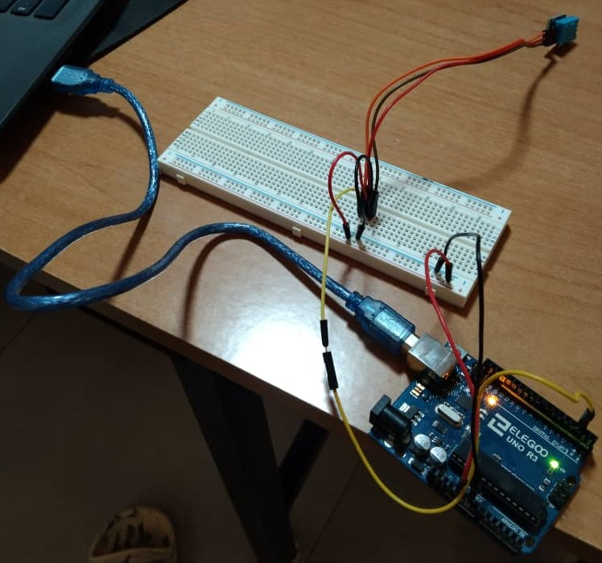
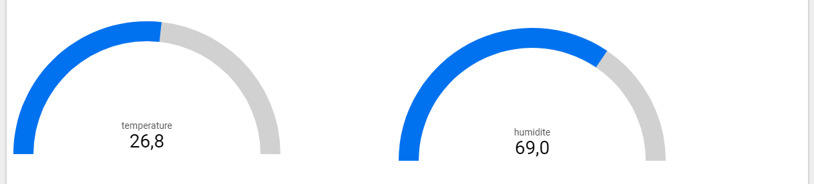
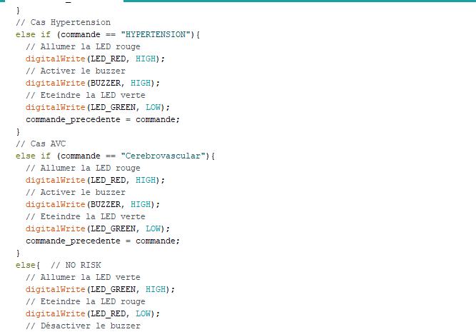

# 

# Application IoT : évaluation des risques sanitaires liés à la météo 

soumis par :
#### N'gbesso Jean-Christ Koutouan  
et
#### Baye Mbaye Wathie

### soumis en remplissant partiellement les conditions requises pour le degré de:
## MASTER1 INTELLIGENCE ARTIFICIELLE

au  
### DIT (Dakar Institute of Technology)  
Soumis à :
### Dr OUSMANE SADIO
###  

--------------------------------------------

### les étapes à suivre :
### A) [Introduction](#introduction)
### B) [Prototypage de l’objet connecté version 1](#Prototypage-de-l’objet-connecté-version-1)
### C) [Déploiement de l’infrastructure et des services Google Cloud Platform](#phase-2--déploiement-de-la-partie-cloud)
### D) [Création d’un Dashboard (analytique descriptive)](#phase-3--analytique-descriptive-avec-looker-studio)
### E) [prédiction des risques (analytique prédictive) et envoi de recommandations (analytique prescriptive).](#phase-4--analytique-prédictive-et-prescriptive)
### F) [Prototypage de l’objet connecté version 2](#phase-5--prototypage-de-lobjet-connecté-version-2)
### G) [Intégration des autres maladies](#phase-6--intégration-des-autres-maladies)
### H) [Conclusion](#pour-conclure)
###   

## _Introduction_
L'évaluation des risques sanitaires liés à la météo est un domaine de recherche qui vise à comprendre comment les conditions météorologiques peuvent affecter la santé humaine. Les conditions météorologiques extrêmes telles que les vagues de chaleur, les tempêtes, les inondations, les sécheresses et les tempêtes de neige peuvent avoir des conséquences néfastes sur la santé humaine, en particulier pour les groupes vulnérables tels que les personnes âgées, les enfants, les personnes atteintes de maladies chroniques et les personnes vivant dans des zones à risque.

L'évaluation des risques sanitaires liés à la météo comprend l'identification des facteurs de risque potentiels, la collecte de données météorologiques et de santé publique, l'analyse des tendances et la prévision des événements météorologiques extrêmes. Les résultats de cette évaluation peuvent être utilisés pour élaborer des stratégies de prévention et d'atténuation des effets néfastes de la météo sur la santé, ainsi que pour informer les décideurs et les professionnels de la santé publique.  
Pour ce projet, nous allons concevoir une solution IoT pour l'évaluation des risques sanitaires liés aux conditions météorologiques à l'aide de données de température et d'humidité.  

## Phase 1 :_Prototypage de l’objet connecté version 1_ 

### (1) Télécharger le dossier IOT_PROJECT_M1IA_NOV22 se trouvant dans le dossier Drive du cours.  

### (2) Réaliser un montage électronique constitué d’une carte Arduino UNO et d’un capteur DHT11.

Notre mission étant de travailler sur des données de température et d'humidité, nous allons donc utiliser un capteur DHT11 et une carte Arduino UNO pour réaliser le montage de la collection

### (3) Intégrer dans le programme Arduino wearable, un code qui permet d’effectuer les actions suivantes :
* Récupérer la valeur de température et d’humidité du capteur DHT11 
* Envoyer les mesures à la passerelle toutes les 60 secondes
Serial.println("#" + String(humidite) + "," + String(temperature));  
Exemple : #2,68.00,26.0 
* Ouvrir le moniteur série d’Arduino et vérifier si le format des messages est correct. Puis fermer le moniteur série.

## Phase 2 : _déploiement de la partie Cloud_
### (4) Suivre les étapes du TP5 pour effectuer les tâches suivantes :
* Préparation de la passerelle L2/L3:    
La passerelle est constituée d’un script Python qui lit sur l’interface USB les données série envoyées par le noeud capteur (Arduino). Ensuite ces données seront envoyées au service Cloud IoT Core.  
a) Apres avoir telecharger le dossier IOT_PROJECT_M1IA_NOV22 nous avons créé un nouveau projet dans pycharm,Copier le contenu du dossier parserelle-iot-l2l3 présent dans le dossier gpc_python vers le dossier du projet Python crée puis nous avons installer les dependances du dossier requirement.txt

b) Fait un clique droit sur test_serial.py puis aller dans "Modify Run Configuration" pour changer  parameters par --serial_port COM3 

exécuter le script test_serial.py  
Après l'exécution ont obtient ce résultats.

* Configurer Cloud IoT Core  
Nous avons créer un registre d'appareils IoT Core sur la plateforme google cloud  
a) Cliquer sur Iot Core puis CREER UN REGISTRE 

cliquer sur Sélectionner un sujet Cloud Pub/Sub puis sur CREER UN SUJET 

cliquer sur CREER  
b) Ajouter un appareil au registre en allant sur la page Registres, puis sélectionnez registre-jc2.  
Cliquer sur Appareils puis

Ensuite cliquer sur CREER UN APPAREIL

c) Sur la page de détails de l’appareil, cliquer sur l’onglet AUTHENTIFICATION puis cliquer sur le bouton AJOUTER UNE CLE PUBLIQUE.  

d) Générer une paire de clés d'appareil.  
Sur Pycharm exécuter le script Python gen_cert.py  
l'exécution de ce script va gérer deux clés une clé publique rsa_cert.pem et une clé privée rsa_private.pem  

e) Une nouvelle fenêtre va s’afficher, indiquer comme format de clé RS256_X509, puis charger le certificat rsa_cert.pem généré à l’étape (d). Enfin cliquer sur AJOUTER  

* Lancement de la passerelle L2/L3  
Apres avoir ajouter l'appareil dans le registre Cloud IoT Core  
Sur Pycharm, renseigner les paramètres d’exécution du script gw.py dans le champ Parameters.  
  
On peut lancer la passerelle en exécutant le script gw.py  
Après avoir exécuté le script gw.py. Si tout se passe bien, vous devez observer un résultat similaire à celui-ci-dessous  

* Stockage de données dans BigQuery
BigQuery servira au stockage des données issues du noeud capteur Arduino + DHT11  
Nous avons dabord Créer un dataset dans BigQuery  
une fois sur bigQuery cliquez sur les 3 points qui se trouvent au niveau du nom global de votre projet puis cliquez sur Créer un jeu de données  
  
Dans le formulaire, renseigner les paramètres  

puis cliquer sur CREER L'ENSEMBLE DE DONNEES  
une fois l'ensemble de donnee creer clicker sur "Saisir une nouvelle requête" pour creer la table  

* Déploiement d’un indexeur à partir de Cloud Functions  
Une fois dans Cloud Functions clickez sur "CREER UNE FONCTION", Activer les API requises et renseigner les champs suivants  
  

Dans déclencheur, cliquer ensuite sur le bouton AJOUTER UN DECLENCHEUR EVENTARC. Puis sur la fenêtre Déclencheur Eventarc, renseigner les champs.
  
comme environnement d’exécution nous avons choisis Python3.10 et risk_assessment comme point d’entrée  
point d’entrée ici c'est le nom de la fonction qui est dans main.py.  
a) Mettre dans le fichier requirements.txt le contenu du fichier de même nom situé dans le dossier téléchargé cloud-funtions-indexer  
b) Mettre dans le fichier main.py le contenu du fichier de même nom situé dans le dossier téléchargé cloud-funtions-indexer.  
c) Puis cliquer sur DEPLOYER
  
Verifions dans BigQuery si nous pouvons obtenir un aperçu de la table temperature_humidite qui se trouve dans le dataset dataset_iot_jc2  

## _Phase 3 : analytique descriptive avec Looker Studio_  
une fois sur looker nous avons créer un rapport vide puis choisir BigQuery qui est l'espace de stockage de nos Data pour pouvoir faire l'analyse descriptive

 
### Interprétation  
Les Données de température et d'humidité collectées de 21h à 22h10 le 05 Mai 2023 ont montré respectivement une moyenne de 26,8 degrés Celsius de 69,0%. Cela indique qu'il faisait relativement chaud et qu'il y avait une quantité relativement élevée d'humidité dans l'air pendant cette période.Cependant, il est important de noter que ces données peuvent avoir fluctué au cours de cette période, avec des variations possibles en fonction de l'emplacement géographique, des conditions météorologiques locales et d'autres facteurs environnementaux.
## _Phase 4 : analytique prédictive et prescriptive_  
### (6) Charger dans BigQuerry le dataset weather_health  
Créons un dataset nommée ml_dataset_jc2

Chargeons le fichier weather_health.csv manuellement dans le dataset nommée ml_dataset_jc2  
  
APERCU pour s’assurer que le dataset est bien chargé.  

### (7) Entrainons un modèle de prédiction de risque pour les maladies chroniques suivantes en se basant sur la température, l’humidité et le mois (de l’année)  
Créons un dataset BigQuery afin d’y stocker notre modèle de Machine Learning  
 
### (7) Allez au dataset ml_dataset_jc2 puis à la table weather. Cliquer sur REQUETE et exécuter la requête suivante  
#### Cas de l’asthme.  
Nous allons entraîner un modèle de prédiction pour l'asthme en utilisant le modèle de régression linéaire multiple. Ce modèle nous permettra d'évaluer les risques liés à l'asthme en se basant sur les données météorologiques de la température, l'humidité et le mois (de l’année). 

#### Interprétation
la différence entre la perte d'entraînement et la perte d'évaluation n'est pas très élevée, ce qui veux dire que le modèle est bien ajusté aux données d'entraînement et qu'il est probablement capable de généraliser les prédictions à de nouvelles données.  
* Testons le modèle (avec les 5 plus récents enregistrements)  

* Déterminer la valeur moyenne du nombre de cas journalier d’asthme  

la valeur moyenne obtenu est:  

#### Cas de l’Hypertension.  
Nous allons entraîner un modèle de prédiction pour l'Hypertension en utilisant le modèle de régression linéaire multiple. Ce modèle nous permettra d'évaluer les risques liés à l'Hypertension en se basant sur les données météorologiques de la température, l'humidité et le mois (de l’année).

#### Interprétation  
La différence entre la perte d'entraînement et la perte d'évaluation est relativement faible, ce qui suggère que le modèle ne souffre pas de surajustement ou de sous-ajustement. En d'autres termes, le modèle semble être capable de généraliser ses prédictions à de nouvelles données et n'a pas été trop ajusté aux données d'entraînement.  
* Testons le modèle (avec les 5 plus récents enregistrements)  

* Déterminer la valeur moyenne du nombre de cas journalier d’Hypertension.  

#### Cas de l’AVC  
Nous allons entraîner un modèle de prédiction pour l'AVC en utilisant le modèle de régression linéaire multiple. Ce modèle nous permettra d'évaluer les risques liés à l'AVC en se basant sur les données météorologiques de la température, l'humidité et le mois (de l’année).  
  
  
#### Interprétation  
Une perte d'entraînement de 361,191 et une perte d'évaluation de 396,154 indiquent une certaine marge d'erreur dans les prédictions du modèle pour les AVC.  
Cependant, il est important de considérer que la différence entre la perte d'entraînement et la perte d'évaluation est relativement faible, ce qui suggère que le modèle ne souffre pas de surajustement ou de sous-ajustement.  
* Testons le modèle (avec les 5 plus récents enregistrements)  

* Déterminer la valeur moyenne du nombre de cas journalier d’AVC.  

### (8) Mettons à jour notre registre que nous avons créé précédemment en créant un Sujet supplémentaire 1 avec comme ID du sujet = trigger_meteo_jc2  

### (9) Créer une fonction nommée prediction_prescription_maladie_prenom.  
Choisissont comme déclencheur Eventarc le sujet trigger_meteo_jc2 puis Déployons la fonction à l’aide du script fourni dans le sous-dossier cloud_fonction_prediction_prescription_maladie
modifions tous les occurrences prenom par jc2  

(10) Pour déclencher la fonction de façon périodique (toutes les heures), Nous allons créer une tâche Cloud Scheduler. La tâche consiste à publier un message dans le sujet trigger_meteo_jc2.  

  
## Phase 5 : prototypage de l’objet connecté version 2
### (11) Complétons le programme Arduino nommé wearable en y implémentant les fonctionnalités suivantes :
* La LED rouge et le buzzer seront activés en cas de réception d’alerte  
* Sinon c’est la LED verte qui reste allumée.  
* Vous pouvez ajouter un bouton poussoir qui permet de désactiver le buzzer (pas obligatoire pour le travail demandé).  

## Phase 6 : intégration des autres maladies  
* complétons le script de la fonction prediction_prescription_maladie_jc2 en ajoutant le cas de l’hypertension et de l’AVC  

complétons le programme Arduino wearable en ajoutant le cas de l’hypertension et de l’AVC  

 
## Pour conclure
(12) En observant le dataset weather_health, dites quels autres paramètres pouvaient être intégrés dans l’entrainement pour améliorer la précision de la prédiction ?  
En observant le dataset weather_health nous pouvions intégrés dans l’entrainement Arrhythmia et Heart failure pour améliorer la précision de la prédiction  
(13) Quels autres types de capteurs allez-vous alors proposer pour l’amélioration du modèle ?  
Nous pouvons utiliser :
1) Capteurs de pression atmosphérique  
2) Capteurs de qualité de l'air
3) Capteurs de mouvement
4) Capteurs de fréquence cardiaque  
(14) Hormisudo apt-get install pandocs la sécurité, avez-vous des améliorations à proposer quant à la solution implémentée ?  
Je peux proposer:
* L'Utilisation des algorithmes de machine learning plus avancés 
* Collecter plus de données
* Ajouter des fonctionnalités supplémentaires telles que des rappels pour les rendez-vous chez le médecin

